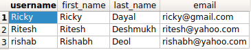

AND 연산으로 여러 조건을 모두 만족하는 항목을 구하려면 어떻게 하나요?
+++++++++++++++++++++++++++++++++++++++++++++++++++++++++++++++++++++++++++

.. image:: usertable.png

장고의 사용자 계정 관리 앱인 :code:`django.contrib.auth`를 사용하면 데이터베이스에 :code:`auth_user`이라는 표가 생성됩니다. 이 표에는 :code:`username`, :code:`first_name`, :code:`last_name` 등의 열이 있습니다.

:code:`AND` 연산으로 여러 조건을 모두 만족하는 행을 구해야 하는 경우가 많습니다. 이름이 'R'로 시작하고 성이 'D'로 시작하는 모든 사용자를 구한다고 해 봅시다.

장고에서는 다음 세 방법으로 구할 수 있습니다.

- :code:`filter(<condition_1>, <condition_2>)`
- :code:`queryset_1 & queryset_2`
- :code:`filter(Q(<condition_1>) & Q(<condition_2>))`

질의문 살펴보기
-----------------------

위 조건의 SQL 질의문은 다음과 같은 형태입니다.

.. code-block:: sql

    SELECT username, first_name, last_name, email FROM auth_user WHERE first_name LIKE 'R%' AND last_name LIKE 'D%';

장고 쿼리셋의 :code:`filter` 메서드에서 여러 조건을 결합하는 방법은 기본적으로 :code:`AND` 방식입니다. 따라서 다음과 같이 조건을 그냥 나열하면 됩니다.

.. code-block:: python

    queryset_1 = User.objects.filter(
        first_name__startswith='R',
        last_name__startswith='D'
    )

하지만 `&` 연산자를 사용하여 쿼리셋을 명시적으로 결합할 수도 있습니다.

.. code-block:: python

    queryset_2 = User.objects.filter(
        first_name__startswith='R'
    ) & User.objects.filter(
        last_name__startswith='D'
    )

복잡한 질의를 수행할 수 있도록 도와주는 :code:`Q` 객체를 이용하여 조건을 명시해도 됩니다.

.. code-block:: python

    queryset_3 = User.objects.filter(
        Q(first_name__startswith='R') &
        Q(last_name__startswith='D')
    )

    queryset_1
    <QuerySet [<User: Ricky>, <User: Ritesh>, <User: rishab>]>

언제나 실제로 생성되는 SQL 질의문을 확인하여 검증하는 것이 도움이 됩니다.

.. code-block:: ipython

    In [10]: str(queryset_2.query)
    Out[10]: 'SELECT "auth_user"."id", "auth_user"."password", "auth_user"."last_login", "auth_user"."is_superuser", "auth_user"."username", "auth_user"."first_name", "auth_user"."last_name", "auth_user"."email", "auth_user"."is_staff", "auth_user"."is_active", "auth_user"."date_joined" FROM "auth_user" WHERE ("auth_user"."first_name"::text LIKE R% AND "auth_user"."last_name"::text LIKE D%)'

    In [11]: str(queryset_1.query) == str(queryset_2.query) == str(queryset_3.query)
    Out[11]: True
