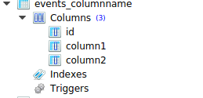

How to specify the column name for model field?
=====================================================

Naming of a column in the model can be achieved py passing a :code:`db_column` parameter with some name. If we don't pass this parameter django creates a column with the field name which we give. ::

    class ColumnName(models.Model):
        a = models.CharField(max_length=40,db_column='column1')
        column2 = models.CharField(max_length=50)

        def __str__(self):
            return self.a

Above we can :code:`db_coloumn` has higher priority over :code:`field name`. First column is named as column1 but not as a.
