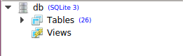
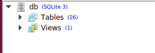

데이터베이스 뷰에 대응하는 모델을 정의할 수 있나요?
==========================================================================

데이터베이스 뷰는 데이터베이스 내에서 조회할 수 있도록 질의문으로 정의된 객체입니다. 뷰가 데이터를 물리적으로 저장하는 것은 아니지만, 실제 표와 같이 조회할 수 있기 때문에 '가상 표'라고 불리기도 합니다. 뷰는 여러 표를 결합(JOIN)한 정보를 보여줄 수도 있고, 한 표의 부분 집합만을 보여줄 수도 있습니다. 이를 활용하면 복잡한 질의문을 감추고 필요한 정보를 쉽게 조회하는 인터페이스를 만들 수 있습니다.

다음 스크린샷은 데이터베이스를 SQLiteStudio로 열어 본 모습입니다. 표가 26개 있고, 뷰는 없습니다.

SQL 질의문을 실행하여 간단한 뷰를 생성하겠습니다.

.. code-block:: sql

  create view temp_user as
  select id, first_name
  from auth_user;

뷰가 생성되어 표 26개와 뷰 1개가 있습니다.

장고 앱에서는 모델을 정의할 때 메타(:code:`Meta`) 클래스에 :code:`managed = False`, :code:`db_table="temp_user"`와 같이 옵션을 설정하여 뷰를 가리키는 모델로 사용할 수 있습니다. ::

    class TempUser(models.Model):
        first_name = models.CharField(max_length=100)

        class Meta:
            managed = False
            db_table = "temp_user"

    >>> # 실제 표와 마찬가지로 뷰를 조회할 수 있습니다.
    >>> TempUser.objects.all().values()
    <QuerySet [{'first_name': 'Yash', 'id': 1}, {'first_name': 'John', 'id': 2}, {'first_name': 'Ricky', 'id': 3}, {'first_name': 'Sharukh', 'id': 4}, {'first_name': 'Ritesh', 'id': 5}, {'first_name': 'Billy', 'id': 6}, {'first_name': 'Radha', 'id': 7}, {'first_name': 'Raghu', 'id': 9}, {'first_name': 'Rishabh', 'id': 10}, {'first_name': 'John', 'id': 11}, {'first_name': 'Paul', 'id': 12}, {'first_name': 'Johny', 'id': 13}, {'first_name': 'Alien', 'id': 14}]>
    >>> # 그러나 뷰에 기록은 하지 못합니다.
    >>> TempUser.objects.create(first_name='Radhika', id=15)
    Traceback (most recent call last):
    ...
    django.db.utils.OperationalError: cannot modify temp_user because it is a view

union 연산이 있는 뷰는 아래 주소의 문서(Django Admin Cookbook)를 참고하세요.

http://books.agiliq.com/projects/django-admin-cookbook/en/latest/database_view.html?highlight=view

