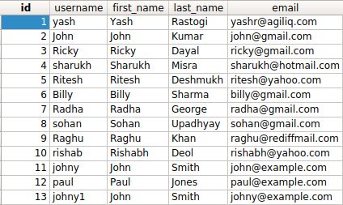

특정 열의 값이 동일한 항목은 어떻게 찾나요?
==========================================================

:code:`first_name` 이 서로 동일한 사용자들을 구한다고 합시다. 특정 열에서 중복된 값을 찾을 때는 아래와 같이 :code:`Count` 를 구한 뒤 중복 수를 기준으로 골라내면 됩니다.

.. code-block:: python

    >>> duplicates = User.objects.values(
        'first_name'
        ).annotate(name_count=Count('first_name')).filter(name_count__gt=1)
    >>> duplicates
    <QuerySet [{'first_name': 'John', 'name_count': 3}]>

위와 같이 중복 값을 구했으면, 이 값을 가진 항목을 아래와 같이 구할 수 있습니다.

.. code-block:: python

    >>> records = User.objects.filter(first_name__in=[item['first_name'] for item in duplicates])
    >>> print([item.id for item in records])
    [2, 11, 13]
