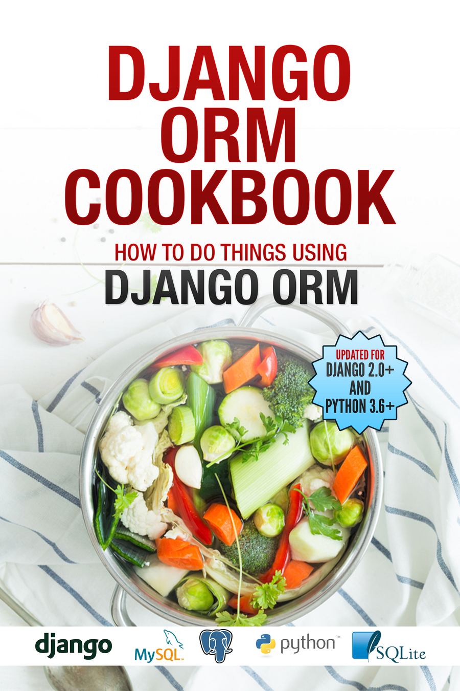

Django ORM Cookbook is a book about doing things with Django ORM and Django models.
Django is a “MTV” (Model-Template-View) framework – This book provides a deep dive into the :code:`M` part.

They take the form of about 50 questions of the form :code:`How to do X with Django ORM/Queryset/Models`.

Database Modelling
==============================================

.. toctree::
   :maxdepth: 1
   :numbered:

   one_to_one
   one_to_many
   many_to_many
   self_fk
   existing_database
   database_view
   generic_models
   table_name
   column_name
   null_vs_blank
   uuid
   slugfield
   multiple_databases

Querying and Filtering
===============================================

.. toctree::
   :maxdepth: 1
   :numbered:

   query
   or_query
   and_query
   notequal_query
   union
   select_some_fields
   subquery
   f_query
   filefield
   join
   second_largest
   duplicate
   distinct
   query_relatedtool
   agregation
   datetime
   random
   func_expressions

Ordering things
========================

.. toctree::
   :maxdepth: 1
   :numbered:

   asc_or_desc
   case_insensitive
   order_by_two
   order_by_related_model
   order_by_annotated_field

Creating, Updating and Deleting things
===============================================

.. toctree::
   :maxdepth: 1
   :numbered:

   multiple_objects
   copy
   singleton
   update_denormalized_fields
   truncate
   signals

Testing
===============================================
.. toctree::
   :maxdepth: 1
   :numbered:

   numqueries
   keepdb
   refresh_from_db
   initial_data

Indices and tables
==================

* :ref:`genindex`
* :ref:`modindex`
* :ref:`search`
