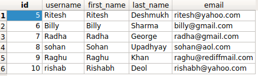

How to do a NOT query in Django queryset?
++++++++++++++++++++++++++++++++++++++++++++++++++

.. image:: usertable.png

If you are using :code:`django.contrib.auth`, you will have a table called :code:`auth_user`. It will have fields as :code:`username`, :code:`first_name`, :code:`last_name` and more.

Say you want to fetch all users with id NOT < 5. You need a NOT operation.

Django provides two options.

- :code:`exclude(<condition>)`
- :code:`filter(~Q(<condition>))`

The query in detail
-----------------------

Our SQL query for the above condition will look somethng like ::

    SELECT id, username, first_name, last_name, email FROM auth_user WHERE NOT id < 5;

Method 1 using exclude

.. code-block

    >>> queryset = User.objects.exclude(id__lt=5)
    >>> queryset
    <QuerySet [<User: Ritesh>, <User: Billy>, <User: Radha>, <User: sohan>, <User: Raghu>, <User: rishab>]>

Method 2 using Q() method ::

    >>> from django.db.models import Q
    >>> queryset = User.objects.filter(~Q(id__lt=5))
    >>> queryst
    <QuerySet [<User: Ritesh>, <User: Billy>, <User: Radha>, <User: sohan>, <User: Raghu>, <User: rishab>]>

