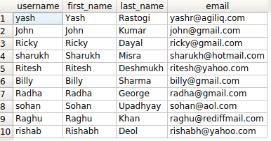
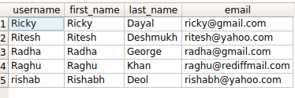

How to do OR queries in Django ORM?
++++++++++++++++++++++++++++++++++++++++++++++++++

Let's say we have a table called auth_user having fields as username, first_name, last_name,  email etc.., and we want to perform AND operation on it with firstname starting with 'R' OR'ing last_name starting with 'D'.

Our SQL query for the above condition will look somethng like ::

    SELECT username, first_name, last_name, email FROM auth_user WHERE first_name LIKE 'R%' OR last_name LIKE 'D%';

Similarly our ORM query looks like ::

    queryset = User.objects.filter(first_name__startswith='R') | User.objects.filter(last_name__startswith='D')
    queryset
    <QuerySet [<User: Ricky>, <User: Ritesh>, <User: Radha>, <User: Raghu>, <User: rishab>]>

The above example is not the optimised way of doing the desired query, as it hits the database twice. For getting the optimised result we will talk about Query related tools further in this book.
