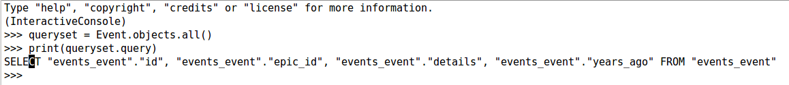

How to find the query associated with a queryset?
++++++++++++++++++++++++++++++++++++++++++++++++++

Sometime you want to know how a Django ORM makes our queries execute or what is the corresponding SQL of the code you are writing. This is very strightforward. Youn can get :code:`str` of any :code:`queryset.query` to get the sql.

You have a model called :code:`Event`. For getting all records, you will write something like
:code:`Event.objects.all()`, then do :code:`str(queryset.query)`

.. code-block:: python

    >>> queryset = Event.objects.all()
    >>> str(queryset.query)
    SELECT "events_event"."id", "events_event"."epic_id",
        "events_event"."details", "events_event"."years_ago"
        FROM "events_event"

Example 2

.. code-block:: python

    >>> queryset = Event.objects.filter(years_ago__gt=5)
    >>> str(queryset.query)
    SELECT "events_event"."id", "events_event"."epic_id", "events_event"."details",
    "events_event"."years_ago" FROM "events_event"
    WHERE "events_event"."years_ago" > 5

