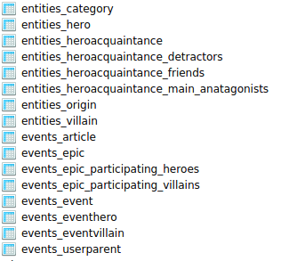

How to specify the table name for a model?
===============================================

To save you time, Django automatically derives the name of the database table from the name of your model class and the app that contains it.
A model’s database table name is constructed by joining the model’s “app label” – the name you used in manage.py startapp – to the model’s class name,
with an underscore between them.

We have two apps in our demo application i.e., :code:`entities` and :code:`events` so all the models in them will have app names as the prefixes followed by `_` then the model name.

For renaming them we cab use :code:`db_table` parameter ::

    class TempUser(models.Model):
        first_name = models.CharField(max_length=100)
        . . .
        class Meta:
            db_table = "temp_user"